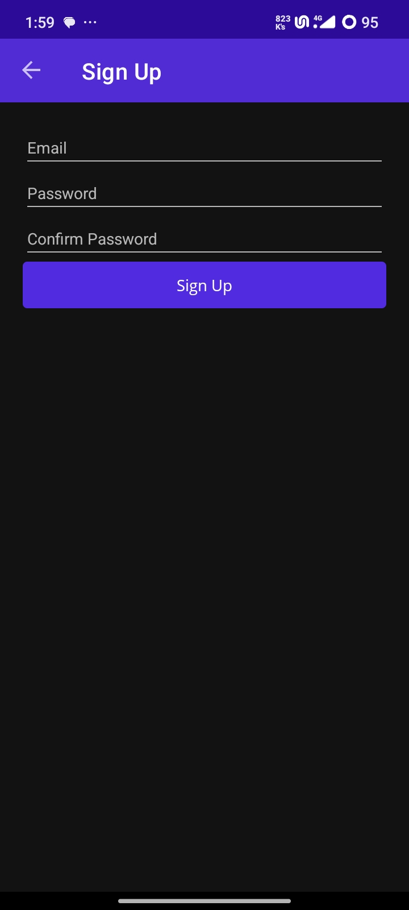

# 6002CEM_-Okafor-Somtochuckwu-
## Documantation
## Overview

A todo list management system is implemented by the MAUI-based application TodoApp. It makes use of Firebase for data storage and authentication, the MVVM (Model-View-ViewModel) architectural pattern, and Inversion of Control (IoC) for dependency management.

## Architecture

### Model-View-ViewModel, or MVVM

The programme adheres to the MVVM pattern:

- **Models**: The data structures are represented by `TodoItem} and `Subtask}.
- **Views**: XAML-based user interface pages (such as `CalendarPage}, `TodoListPage}, and `TodoItemPage}).
- **ViewModels**: The data binding and business logic are handled by `TodoItemViewModel` and `CalendarViewModel`.

### Control Inversion (IoC)

Dependency injection is used to implement IoC principles, especially in the `DatabaseService` and `AuthService` classes.

## Integration with Firebase

### Firebase Auth Entity Authentication

User authentication is managed by the `AuthService` class:

- {SignUpWithEmailAndPassword}: Creates a new user account.
- {SignInWithEmailAndPassword}: Allows a preset user to log in.
A password reset email is sent using the `SendPasswordResetEmailAsync} function.

### Firebase Realtime Database (###)

Data operations are managed by the `DatabaseService` class:

- {GetTodoItemsAsync}: This function retrieves every to-do item.
- {SaveTodoItemAsync}: This function updates or saves a task item.
- {DeleteTodoItemAsync}: Removes a to-do item from the list.
- {GetSubtasksAsync}: Returns subtasks associated with a given to-do item.
- {SaveSubtaskAsync}: This function updates or saves a subtask.
The {DeleteSubtaskAsync} command removes a subtask.

## Important Elements

### ViewModels

1. {BaseViewModel}: Provides data binding support for `INotifyPropertyChanged}.
2. {TodoItemViewModel}: Oversees subtasks and to-do lists.
3. {CalendarViewModel}: Manages tasks associated with calendars.

### Providers

1. Firebase Realtime Database is accessed by `DatabaseService}.
2. Firebase Authentication is managed by {AuthService}.

### Models

A to-do job is represented by a {TodoItem}.
2. {Subtask}: Indicates a TodoItem's subtask.

### Views

1. {LoginPage}: The interface for user login.
2. {SignUpPage}: The updated user registration page.
3. {TodoListPage}: Presents the to-do list.
4. {TodoItemPage}: Allows you to see and update a to-do item in detail.
5. {CalendarPage}: To-do list in calendar view.

## Configuring Firebase

The `FirebaseConfig` class stores the Firebase configuration, which includes the URLs and keys needed to access Firebase services.

## Final Thoughts

This TodoApp showcases an MVVM-based, well-organized MAUI application with Firebase connectivity for backend services. It demonstrates how to properly divide up the concerns, which makes the code manageable and modular.

## Firebase Interface Displaying Authenticated / Registered Users

/Users/nathan/TodoApp-.Net/assets/Screenshot 2024-07-06 at 1.57.03 PM.png

#Application Features And Images

.jpg)
.jpg)
.jpg)
.jpg)
.jpg)
.jpg)
